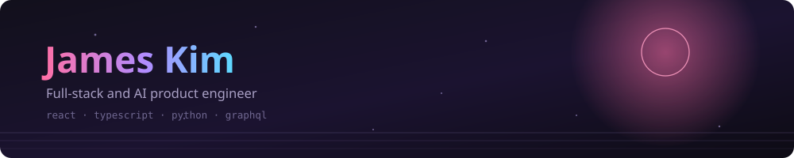

### → **[rlawoals0529.github.io](https://rlawoals0529.github.io)** — all of it in one place, 17 running in your browser

**TypeScript · React · Next.js · GraphQL · Python · FastAPI · PostgreSQL**

I work mostly on frontend product engineering, in React and TypeScript, with the backend and
AI services behind it. Lately most of what I build is either **for** agents or **run by**
them.

Three things I keep coming back to:

- **A claim is not evidence.** Most of my tooling exists because something reported green
  while guarding nothing.
- **Unknown is never zero.** A fabricated `0%` is indistinguishable from an idle machine,
  and it is the number a person acts on.
- **Make the invariant mechanical.** A rule nobody can forget beats a rule everybody agrees
  with.

### Right now

**[FantasyStats](https://fantasystats.rlawoals0529.workers.dev)** tells you the odds rather than
a score, because a projection does not beat a season average and the page says so in its own
headline. Four seasons, 24,616 player-weeks: the typical weekly error is 6.2 points against a
mean of seven. So every player is a distribution rather than a number, nothing is ranked that
cannot be told apart, and the spike probability is the shaded area rather than a figure printed
beside it.

**[sidereal](https://sidereal.rlawoals0529.workers.dev)** is a night sky you can leave open and
look around, shared with whoever else has it open. Every light in it traces to a live
measurement: Wikipedia edits as meteors, USGS earthquakes as ground pulses, the ISS on its real
track, the NOAA aurora forecast, and 8,920 Hipparcos stars behind them. One Durable Object on the
edge holds the room, so it opens with no cold start. A test fails the build if anything is drawn
that no measurement is behind.

### What I have built

<!-- projects:start -->

| Project | What it is |
| --- | --- |
| **[rlawoals0529.github.io](https://github.com/rlawoals0529/rlawoals0529.github.io)** `TypeScript` | Everything I have built, in one place |
| **[agent-skills](https://github.com/rlawoals0529/agent-skills)** `JavaScript` | Skills for coding agents, built from real failures |
| **[pc-audit](https://github.com/rlawoals0529/pc-audit)** `TypeScript` | What your Windows machine is actually costing you |
| **[FantasyStats](https://github.com/rlawoals0529/FantasyStats)** `TypeScript` | Fantasy football as odds, graded against what actually happened |
| **[pane](https://github.com/rlawoals0529/pane)** `JavaScript` | Script a Chrome tab over the DevTools Protocol |
| **[yozora](https://github.com/rlawoals0529/yozora)** `CSS` | Fifteen nocturnal colour themes for VS Code and terminals |
| **[tokenview](https://github.com/rlawoals0529/tokenview)** `TypeScript` | Tokenizer and embedding map for language models |
| **[skill-radar](https://github.com/rlawoals0529/skill-radar)** `TypeScript` | Which agent skill actually fires, and why |
| **[skill-lint](https://github.com/rlawoals0529/skill-lint)** `TypeScript` | Linter for agent SKILL.md files |
| **[sidereal](https://github.com/rlawoals0529/sidereal)** `TypeScript` | A night sky you leave open while you work, made of real events |
| **[shelfwear](https://github.com/rlawoals0529/shelfwear)** `TypeScript` | What your Steam library actually gets played |
| **[secondread](https://github.com/rlawoals0529/secondread)** `TypeScript` | Paste code, find out what a reviewer would ask |
| **[notepad](https://github.com/rlawoals0529/notepad)** `TypeScript` | Type maths in prose, answers in the margin |
| **[neon-bar](https://github.com/rlawoals0529/neon-bar)** `TypeScript` | A themeable Zebar status bar for Windows |
| **[hikari](https://github.com/rlawoals0529/hikari)** `JavaScript` | Desktop widgets in HTML, CSS and JavaScript |
| **[discern](https://github.com/rlawoals0529/discern)** `Python` | Eval harness that knows when a difference is noise |
| **[depgraph](https://github.com/rlawoals0529/depgraph)** `TypeScript` | The true install cost of an npm dependency |
| **[decoder](https://github.com/rlawoals0529/decoder)** `TypeScript` | Paste anything, find out what it is |

<sub>Generated from the API. Last refreshed 2026-09-21.</sub>

<!-- projects:end -->

### This page checks itself

The rule above says a claim is not evidence, so this page does not claim anything about
these repositories. It counts them.

<!-- audit:start -->

```
listed repositories   18
with a description    18/18
with a licence        15/18
checked              2026-09-21
```

<!-- audit:end -->

---

<details>
<summary><b>How this page maintains itself</b></summary>

<br>

The table above is generated from the GitHub API by
[`scripts/build-readme.mjs`](scripts/build-readme.mjs), on a schedule and on every push.
Only the block between two markers is rewritten, so everything hand-written survives.

It **fails loudly** rather than writing an empty table on a bad response. A generator that
degrades quietly deletes the section it exists to maintain, and you find out weeks later.

The header is a committed SVG rather than a third-party image service, and there are no
badge images. Nothing on this page is fetched from anywhere at render time, nobody is
tracked, and it works offline.

That is also why there is no stats card or streak counter: both are someone else's server
rendering a number about you, and neither is a thing you built.

</details>
